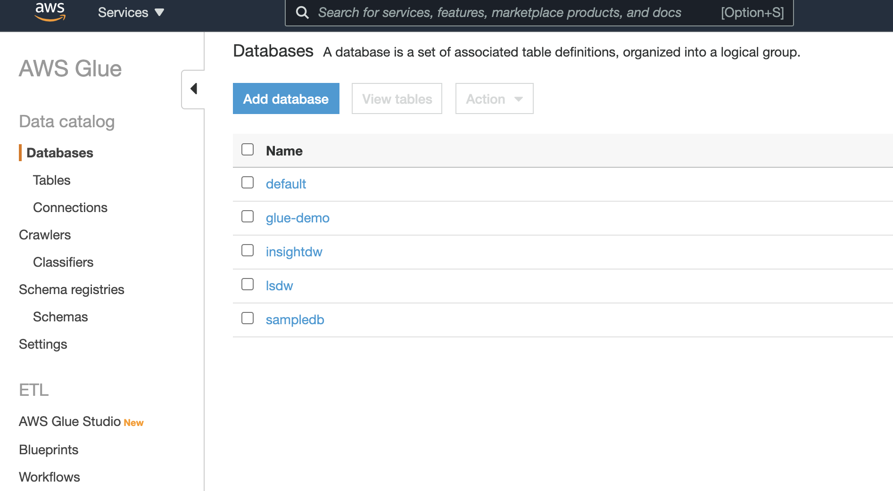
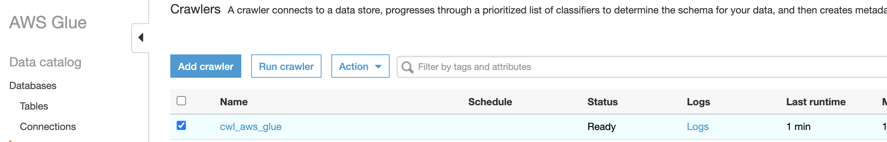
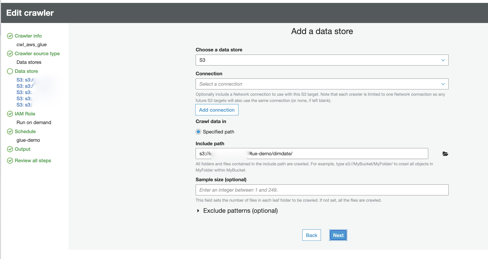
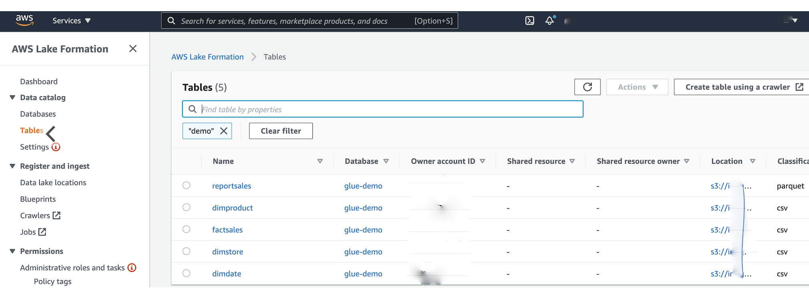
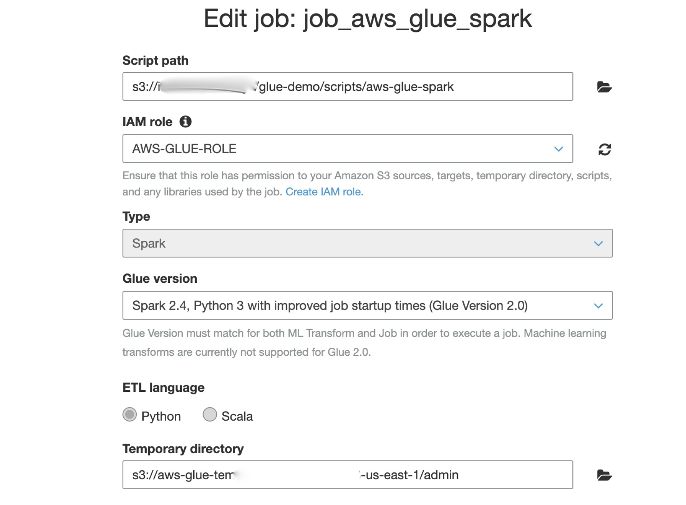
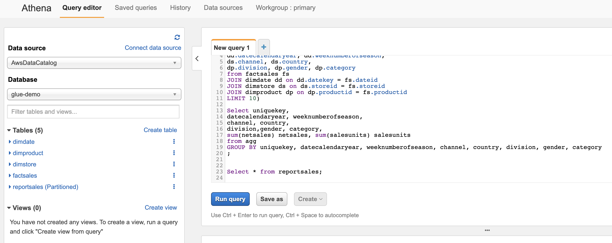

# READ DATA FROM FILES IN S3 and CREATE SALE DETAIL TABLE

## 1. GIVEN DATA

1. product.csv
2. date.csv
3. sales.csv
4. store.csv

## 2. OUTPUT DATA

Consumption.json

NOTE: In this code, added spark glue script to create partitioned consumption file in consumption.parquet format. Partiotioned  by Uniquekey and WeekNo 

## 3. MULTIPLE METHODS TO ACHIEVE SOLUTION WITH AWS

1. Create Airflow platform in EKS/ECS and generate python script with pandas or pyspark to read and write dataset from S3 location

2. Use AWS Glue serverless service with SPARK 2.0 and schedule crawler, jobs, triggers to read and write data from S3 location

3. Use AWS Glue serverless service with Python Shell scricpt and schedule jobs and triggers to read and write data from S3 location

## 4. APPLIED SOLUTION FOR THIS EXERCISE 

Here, I used AWS GLUE with SPARK 2.0 job to achieve the solution.

### 1. WHY SPARK 2.0
    (a) Serverless, Autoscalable, Pay for Usage, Easily configurable  
    (b) Crawler: By creating crawler, and adding tables we can create AWS DATA LAKE formation, with tables and data easily queried from Athena, Redshift (as external table).  
    (c) Parquet: I used parquet format here as a good practice to store data partioned by year/month/date ans also by any partioning column. This helps in easily accessing our data from huge volume of data storage

## 5. STEPS INVOLVED

1. Upload all source files to respective folder in a S3 Bucket

        s3://<bucket name>/dimdate/date.csv
        s3://<bucket name>/dimproduct/product.csv
        s3://<bucket name>/dimstore/store.csv
        s3://<bucket name>/factsales/sales.csv
        
2. Create database and crawler in AWS Glue to create respective tables for dimdate, dimproduct, dimstore. factsales, and as well for Output Sales Consumption report.

### Create Database

### Create Crawler

### Create Datastore & Tables

### AWS Lake Formation

### Create Glue Spark 2.0 Job

### Query from Athena

## 6. Python Script Job
Similar to SPARK 2.0 we can also create python shell script and trigger it to run on schedule basis using simple pandas, pyspark library. The functions in operators.py help you to create effective python script dealing with data processing.

You can run setup.py to create .egg bundle and uplad it to S3 location and refer the bundle in Python Library path while creating Job.
